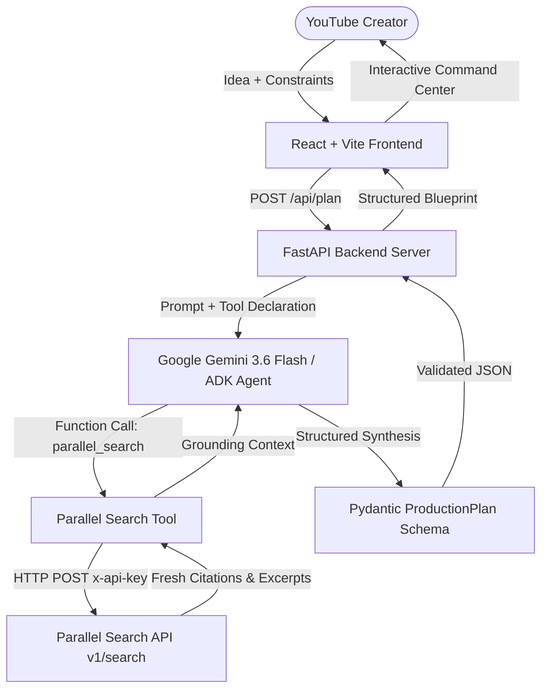

# CreatorPilot 🎬🤖

**CreatorPilot** is an autonomous AI Production Agent and virtual Director for YouTube creators, built for the **Agentic Cinema Hackathon** using **Google's Gemini / Google ADK** and the **Parallel Search API**. Instead of acting as a generic text generator, CreatorPilot evaluates a creator's real-world constraints—such as budget in Indian Rupees (₹), available filming hours, crew size, camera equipment, shooting locations, and experience level—and autonomously determines whether live web research is needed, executing real-time Parallel Search queries to generate a feasible, time-blocked production blueprint.

---

## 🛑 The Problem

Independent YouTube creators spend up to 70% of their production time struggling with pre-production friction:
- **Generic AI Advice:** Existing chatbots provide unrealistic advice (e.g., suggesting 3 camera angles, drone shots, and studio lighting grids to a solo creator filming on a phone with ₹2,000).
- **Stale Market Information:** Creators frequently cover rapidly evolving tools, platform updates, or news without access to fresh market data or live web citations during planning.
- **Runaway Filming Schedules:** Creators consistently underestimate setup and post-production time, resulting in abandoned shoots and creator burnout.
- **Lack of Triage:** When a shoot runs late, creators lack an objective triage framework to know what scenes can be cut without ruining video pacing.

---

## 💡 The Solution

CreatorPilot functions as a dedicated **AI Production Manager and Director**:
1. **Understands the Objective:** Analyzes video premise, target audience, and duration.
2. **Autonomous Research Decision:** Leverages Gemini tool-calling to decide whether live web data is needed, invoking the real Parallel Search API for market freshness.
3. **Adaptive Constraint Engine:** Ingests the creator's real-world limitations (budget, hours, gear, crew, location) and adapts the format, camera work, and editing scope.
4. **Actionable Deliverables:** Delivers an objective feasibility score (0–100), time-blocked production schedule, priority-tagged shot list (`MUST HAVE` vs. `OPTIONAL`), and an *"If You Run Out Of Time"* cut-first triage guide.

---

## 🔄 Agent Workflow

```
Creator Idea & Constraints
        ↓
Google Gemini / ADK Agent Layer
        ↓
Autonomous Research Decision Turn
        ├── (Needs Fresh Market Data) ──> Parallel Search API (v1/search) ──> Live Web Citations
        └── (Creative / Evergreen)   ──> Baseline Grounding
        ↓
Synthesis & Feasibility Engine (Score 0–100)
        ↓
Constraint Adaptation ("Why We Changed The Plan")
        ↓
Production Schedule (Strictly within Available Hours)
        ↓
Priority Shot List & Time Cut Triage
        ↓
Interactive Production Command Center UI
```

---

## 🏗️ Architecture



---

## 🛠️ Technology Stack

- **AI & Agent Layer:** Google Gemini 3.6 Flash / Google GenAI SDK (`google-genai`, `google-adk`)
- **Live Search & Market Intelligence:** Parallel Search API (`https://api.parallel.ai/v1/search`)
- **Backend Framework:** FastAPI (Python 3.11, Pydantic v2, Uvicorn, HTTPX)
- **Frontend Client:** React 19, Vite, Vanilla CSS (Glassmorphism & Responsive Design)
- **Deployment Platform:** Google Cloud Run (Containerized Backend) + Firebase Hosting / Cloud Run (Frontend)

---

## 🌐 Parallel Search Integration

CreatorPilot features a **genuine, runtime integration with the Parallel Search API**:
- **Why Parallel is used:** When creators propose videos regarding evolving topics (e.g., *“current AI coding tools market”*, *“latest changes to YouTube recommendations algorithm”*), static models lack freshness. Parallel provides real-time search with publication dates and domain sources.
- **What is called:** An asynchronous client invokes `https://api.parallel.ai/v1/search` with the required `x-api-key` header and targeted search objectives.
- **Autonomous Trigger:** Gemini declares `parallel_search` as an ADK tool. The model autonomously invokes the tool when current information is required and bypasses it for evergreen topics (e.g., comedy skits).
- **Plan Impact:** Returned citations, tool release notes, and industry benchmarks directly ground the video script outline, retention hooks, and talking points.

---

## ⚙️ Environment Variables

### Backend Configuration (`backend/.env`)
```bash
# Google Gemini API Key (Required)
# Get a free key at https://aistudio.google.com/app/apikey
GEMINI_API_KEY=your_gemini_api_key_here

# Parallel Search API Key (Required for live search track)
# Get your key at https://platform.parallel.ai
PARALLEL_API_KEY=your_parallel_api_key_here

# Server Configuration
HOST=0.0.0.0
PORT=8000
ENVIRONMENT=development

# Allowed CORS Origins (comma-separated or * in development)
ALLOWED_ORIGINS=http://localhost:5173,http://127.0.0.1:5173
```

### Frontend Configuration (`frontend/.env`)
```bash
# Backend API URL
VITE_API_URL=http://localhost:8000
```

---

## 💻 Local Setup & Execution

### 1. Clone & Prepare Repository
```bash
git clone https://github.com/your-username/CreatorPilot.git
cd CreatorPilot
```

### 2. Backend Setup
```bash
cd backend
python -m venv venv

# Activate Virtual Environment:
# On Windows (PowerShell):
.\venv\Scripts\Activate.ps1
# On macOS/Linux:
source venv/bin/activate

# Install Dependencies:
pip install -r requirements.txt

# Configure Secrets:
copy .env.example .env
# Edit .env and paste your GEMINI_API_KEY and PARALLEL_API_KEY

# Start Server:
python -m uvicorn main:app --host 127.0.0.1 --port 8000 --reload
```
Verify the backend health check: `http://127.0.0.1:8000/health`

### 3. Frontend Setup
```bash
cd ../frontend
npm install
npm run dev
```
Open `http://127.0.0.1:5173` in your browser.

---

## 🚀 Google Cloud Deployment Guide

### Deploy Backend to Google Cloud Run

1. **Install and authenticate Google Cloud SDK:**
   ```bash
   gcloud auth login
   gcloud config set project YOUR_PROJECT_ID
   ```

2. **Enable Required Google Cloud APIs:**
   ```bash
   gcloud services enable run.googleapis.com artifactregistry.googleapis.com cloudbuild.googleapis.com
   ```

3. **Deploy with Cloud Run from source:**
   ```bash
   cd backend
   gcloud run deploy creatorpilot-backend \
     --source . \
     --region us-central1 \
     --allow-unauthenticated \
     --set-env-vars "ENVIRONMENT=production,ALLOWED_ORIGINS=*" \
     --set-secrets "GEMINI_API_KEY=GEMINI_API_KEY:latest,PARALLEL_API_KEY=PARALLEL_API_KEY:latest"
   ```
   *Note: Cloud Run will output your live HTTPS backend URL (e.g., `https://creatorpilot-backend-xyz.a.run.app`).*

### Deploy Frontend

1. In `frontend/`, configure your production backend URL:
   ```bash
   # In frontend/.env.production:
   VITE_API_URL=https://creatorpilot-backend-xyz.a.run.app
   ```
2. Build the production assets:
   ```bash
   npm run build
   ```
3. Deploy to Firebase Hosting or Cloud Run static container:
   ```bash
   firebase deploy --only hosting
   ```

---

## 🌟 Live Demo URLs

- **Live Application (Frontend):** [https://creatorpilot-agent.netlify.app](https://creatorpilot-agent.netlify.app)
- **Live Production API (Backend):** [https://creatorpilot-mly5.onrender.com](https://creatorpilot-mly5.onrender.com)
- **API Health Check:** [https://creatorpilot-mly5.onrender.com/health](https://creatorpilot-mly5.onrender.com/health)

---

## 📄 License

This project is licensed under the [MIT License](LICENSE).
